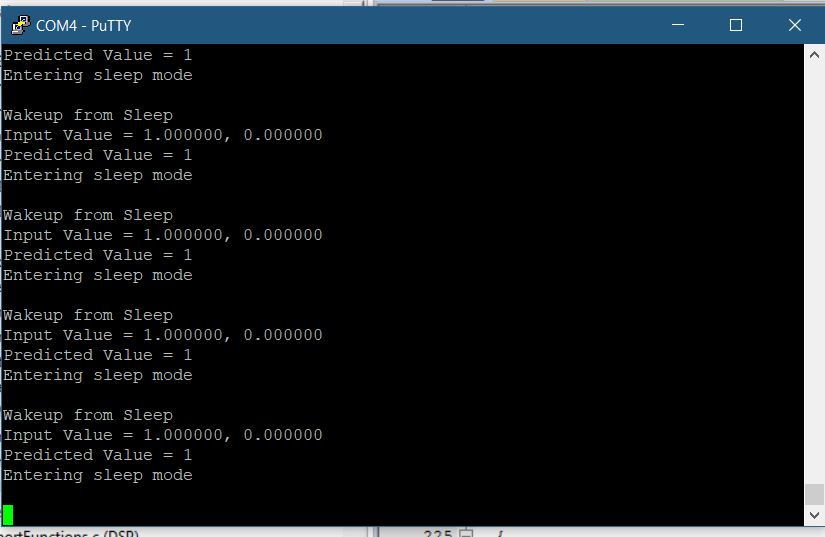

# NB-using-CMSIS-DSP

Implementation of Naive_bayes Classifier using CMSIS-DSP on stm32f4 mcu.

## Description

The repo contains python code for training the Guassian Naive Bayes Classifier using some dummy data given by tutorial https://www.datacamp.com/community/tutorials/naive-bayes-scikit-learn using scikit-learn package. After training is done, various parameters like Gaussian averages, Variances are extracted from it.

Then the same parameters are used in CMSIS DSP naive bayes algorithm and predictions are computed on Stm32f4 mcu.

## Testing
The Image of UART console showing input values and predicted values by microcontroller

